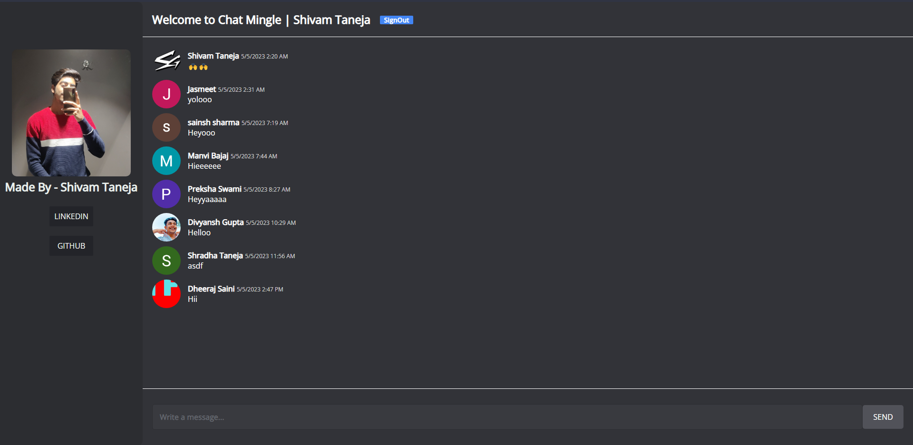

# ChatMingle

ChatMingle is a fun side project that was created as a way to explore modern web technologies and build a fun and engaging chat app. While it's not intended to be a serious or professional-grade application, it is made for a fun and enjoyable chatting experience.

## Accessing the Website

The Web App is hosted on the web and can be accessed using the following link:

[ChatMingle](https://chat-mingle.vercel.app/)

## Screenshot

## Technologies Used

- React
- Firebase
- React Firebase Hooks
- SASS

## Features 

- User authentication: Users can create secure accounts and login.
- Chatting: Users can chat with other logged in users in real-time.
- Real-time updates: Messages are reflected instantly without needing to refresh the page.
- Message history: Users can view their message history and scroll back to previous messages.

## Credits

This was created by Shivam Taneja as a fun project to practice web development skills.

- GitHub: [Shivam Taneja](https://github.com/shiivamtaneja)
- LinkedIn: [Shivam Taneja](https://www.linkedin.com/in/shivam-taneja/)

## Contributions

Contributions are welcome. If you want to contribute to this project, please fork the repository and submit a pull request.